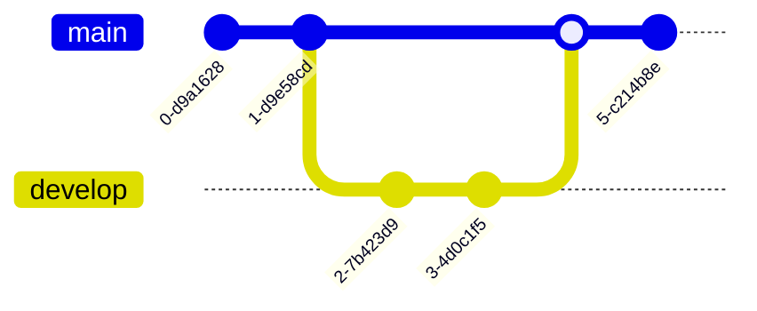

# Exámen medio término

Se requiere a cada equipo realizar una app considerando una serie de factores de los _12 factores_ para una app en la que expongan los datos y/o consultas requeridos en la práctica NoSQL.

## Sobre los factores

Se es requerido que consideren los factores siguientes, mas no están limitados a considerar otros. Los factores imprescindibles son:

1. _Codebase_.
2. Configuración.
3. Servicios de Apoyo.
4. Exposición de Puertos.
5. Bitácoras (_Logs_).

## Consideraciones.

1. Han de trabajar en equipo.
2. Pueden utilizar proyectos realizados en clase como referencia.
3. Compartir los pasos para poder ejecutar la aplicación.
4. Pueden elegir el lenguaje, plataforma y herramientas que les resulte mejor para la entrega.

## Sobre la evaluación

La completitud de los factores comprenden el 80% de la evaluación, el otro 20% corresponde a la extración y exposición de los datos. Arquitectura, estructura, y/o diseño de la aplicación no influenciará en la evaluación.

