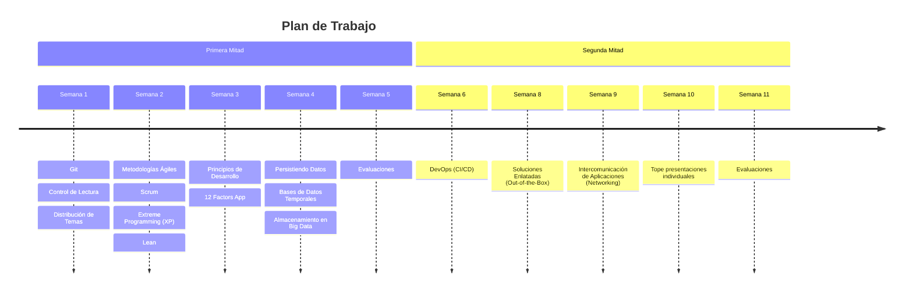

# Participantes

1. Ernesto Mancebo - 0
2. Pazzis Paulino - 1103790
3. Eduardo Segura - 1106648 (Flutter/Dart)

- Equipos
  - **Equipo Segura - Tema#1 Scrum** - **Tema #2 DevOps (CI/CD)**
    - Eduardo Segura - 1106648 (Flutter/Dart)
    - Evans Jimenez - 1105402 (Design Sprint)
    - Jincheng Wu - 1106398 (Vector Database)
    - Manuel Guerrero - 1105793
    - Victor Peña Feliz - 1106630
  - **Equipo 2 - Tema Xtreme Programming** --Segundo Tema Firebase
    - Manuel Sánchez 1104904   (Tema Individual: Vue.Js)
    - Francisco Paulino 1106084
    - Víctor Santos 1105977
    - José Leonardo Cruz 1106529
    - Saul Pinales 1104770
  - **EQUIPO Ferreira - TEMA 1: SERIES TEMPORALES (REDIS, POSTGRES) - TEMA2: UI/UX - Material UI**
    - William Ferreira - 1104228 (Tema Individual: Ruby on Rails)
    - Luis Adames - 1106170 **(Tema Individual: Apache Airflow)**
    - Cistian Jimenez - 1106166
    - Rosanna Bautista - 1105980
    - Jean Brugal - 1105192 (Tema Individual: H20)
  - **Equipo Acosta - Tema 3 Almacenamientos de Big Data**
    - Jean Güichardo - 1105491 (React)
    - Jesus Bido - 1105909 (Posgresql/PostGis)
    - Ricardo Acosta - 1104082 (CouchDB)
    - Wilbert Leon - 1105634
    - Pablo Felix - 1105997
  - **Equipo Angel - Tema pt1: (Tema Metodologia Agile Lean). Tema pt2: (React Native)**
    -	Huan Hao Wu - 1104326 (Progressive Web Apps)
    -	Eros Bencosme - 1104510 (Ionic)
    -	Ángel Moreno - 1104666 (TensorFlow)
    -	Gleidy Espinal - 1104225 (Cypress)
    -	Rolbik Urbáez - 1105721
  - **Equipo Pazzis - Tema pt1: (12 Factors App). Tema pt2: (Docker - Docker Compose - Docker Hub)**
    - Pazzis Paulino 1103790 (NLTK)
    - Paola Saldaña 1104081
    - Alexa Guzmán 1101488
    - Johan Contreras 1106473
    - Allen Silverio 1104220 (Herramienta No-Code: Webflow)
  - **Equipo Mesa - Tema: BBDD de Documentos (couchdb, mongodb, Solr)**
    - Jesús Acosta - 1104174
    - Francisco Mesa - 1104528 (**Pandas** (Python))
    - Eduardo Hernández - 1102911
    - Wancel Javier Ferreras - 1107672
    - Bryan Medina - 1094168
  - **Equipo Rafael - Tema1: BBDD Columnares** __Tema2: Soluciones enlatadas - Odoo__
    - Rafael Espinal - 1102817 (Next.JS)
    - Fernando Grullon - 1094013
    - Rahnya Negron - 1098587
    - Mariano Vásquez - 1087284

## Plan de Trabajo

Distribución de temas y asignaciones a lo largo del trimestre.

