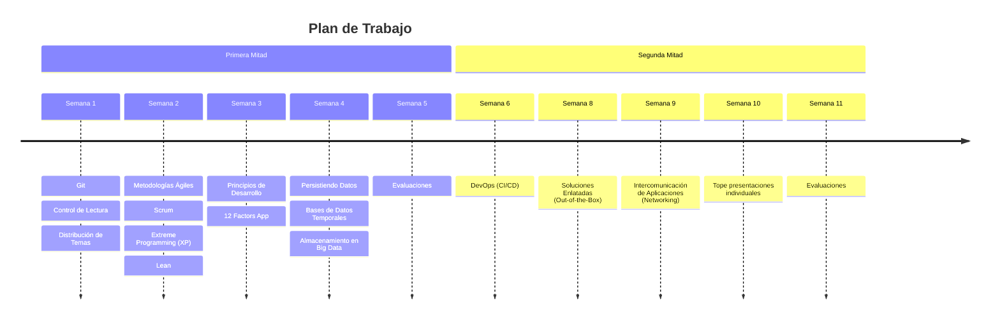

# Participantes

1. Ernesto Mancebo - 0
2. Pazzis Paulino - 1103790
3. Eduardo Segura - 1106648

- Equipos
  - **Equipo Segura - Tema 1 Scrum**
    - Eduardo Segura - 1106648
    - Evans Jimenez - 1105402
    - Jincheng Wu - 1106398
    - Manuel Guerrero - 1105793
    - Victor Peña Feliz - 1106630
  - **Equipo 2 - Tema Xtreme Programming**
    - Manuel Sánchez 1104904
    - Francisco Paulino 1106084
    - Víctor Santos 1105977
    - José Leonardo Cruz 1106529
    - Saul Pinales 1104770
  - **EQUIPO Ferreira - TEMA 3: SERIES TEMPORALES (REDIS, POSTGRES)**
    - William Ferreira - 1104228
    - Luis Adames - 1106170
    - Cistian Jimenez - 1106166
    - Rosanna Bautista - 1105980 
    - Jean Brugal - 1105192
  - **Equipo Acosta - Tema 3 Almacenamientos de Big Data**
    - Jean Güichardo - 1105491
    - Jesus Bido - 1105909
    - Ricardo Acosta - 1104082
    - Wilbert Leon - 1105634
    - Pablo Felix - 1105997
  - **Equipo Angel - Tema Metodologia Agile Lean**
    -	Huan Hao Wu - 1104326
    -	Eros Bencosme - 1104510
    -	Ángel Moreno - 1104666
    -	Gleidy Espinal - 1104225
    -	Rolbik Urbáez - 1105721
  - **Equipo Pazzis - Tema: 12 Factors App**
    - Pazzis Paulino 1103790
    - Paola Saldaña 1104081
    - Alexa Guzmán 1101488
    - Johan Contreras 1106473
    - Allen Silverio 1104220

## Plan de Trabajo

Distribución de temas y asignaciones a lo largo del trimestre.

