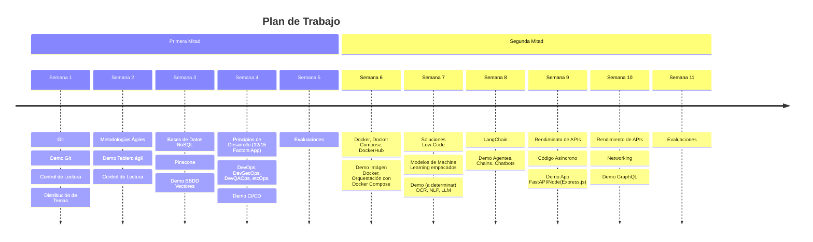
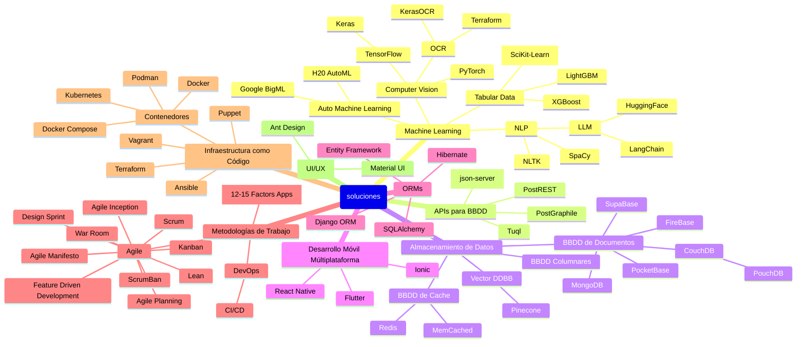

# Plan de Trabajo

A continuación se tiene el listado de actividades a lo largo del trimestre.

## Distribución de Temas

| Equipo   | Presentación del Temario | Semana | Presentación Independiente | Semana | Projecto Lab. |
| -------- | ------------------------ | ------ | -------------------------- | ------ | --------------|
| Equipo 1 |                          |        |                            |        |               |
| Equipo 2 |                          |        |                            |        |               |
| Equipo 3 |                          |        |                            |        |               |
| Equipo 4 |MongoDB                         |3        |Google BigML                            |6        |Realizacion de un Core basico para una tienda con MongoDB               |
| Equipo 5 |                          |        |                            |        |               |
| Equipo 6 |                          |        |                            |        |               |

### Integrantes de Cada Equipo

---

#### Equipo 1

| Miembro | Matrícula |
| ------- | --------- |
|         |           |
|         |           |
|         |           |
|         |           |

---

#### Equipo 2

| Miembro | Matrícula |
| ------- | --------- |
|         |           |
|         |           |
|         |           |
|         |           |

---

#### Equipo 3

| Miembro | Matrícula |
| ------- | --------- |
|         |           |
| JOSE EDUARDO DURAN DEL ROSARIO        |   1074957        |
|         |           |
|         |           |

---

#### Equipo 4

| Miembro | Matrícula |
| ------- | --------- |
|Juan Encarnacion         |1105483           |
|Jamal Mendez         |1106566           |
|Emileidy Duarte         | 1104524          |
|Charles Mendez         |1100349           |
|Wagner Morillo |1107665                   |

---

#### Equipo 5

| Miembro | Matrícula |
| ------- | --------- |
|         |           |
|         |           |
|         |           |
|         |           |

---

#### Equipo 6

| Miembro | Matrícula |
| ------- | --------- |
|         |           |
|         |           |
|         |           |
|         |           |

## Temario

Distribución de temas y asignaciones a lo largo del trimestre.

## Mapa de Temas

Este mapa comprende, mas no limita los distintos temas a abarcar durante el trimestre.

