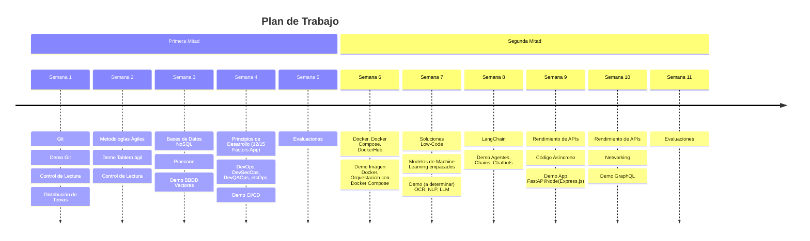
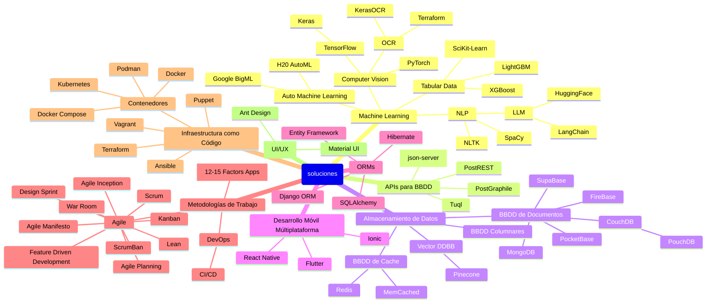

# Plan de Trabajo

A continuación se tiene el listado de actividades a lo largo del trimestre.

## Distribución de Temas

| Equipo   | Presentación del Temario   | Semana | Presentación Independiente | Semana | Projecto Lab. |
| -------- | ------------------------   | ------ | -------------------------- | ------ | ------------- |
| Equipo 1 | Docker                          |  6      |  Django                          |  10      |   Aplicacion venta de tickets para autobuses            |
| Equipo 2 | DevOps                     |   4    |       Angular              |   7    | Mini Shop Online |
| Equipo 3 | NPL                        |   6    |       React Native         |   8    | Language Learning Platform with AI Tutor |
| Equipo 4 | MongoDB                    |   3    |       Google BigML         |   6    | Realizacion de un Core basico para una tienda con MongoDB |
| Equipo 5 | Entity Framework           |   7    |       React                |   9    | Aplicación móvil para crear reseñas sobre estudiantes |
| Equipo 6 | Rendimiento de APIs: Async |   9    |       Mineria de datos     |   4    | Aplicación para agendar citas en un negocio |

### Integrantes de Cada Equipo

---

#### Equipo 1

| Miembro | Matrícula |
| ------- | --------- |
|  Victor Jimenez       |  1106003         |
|  Rusbel Duarte      |  1103307        |
| Jorge saldivar        | 1105996          |
|   Jeremy De los Santos      |   1106973        |
|   Daniel Rondón      |   1088112        |
|   Francisco Barrientos      |   1105584        |

---

#### Equipo 2

| Miembro | Matrícula |
| ------- | --------- |
|    Rayfel Ogando     |  1107535         |
|    Guillermo Jorge    |   1107266        |
|  Denzel Perez       |   1102259        |
|  Sebastian Alcantara       |   1102556        |
|  Avis Zucco       |   1104970        |

---

#### Equipo 3

| Miembro                        | Matrícula |
| ------------------------------ | --------- |
| JEAN CARLOS AZAR TREJO         | 1104992   |
| JOSE EDUARDO DURAN DEL ROSARIO | 1074957   |
| GREGORIO MIGUEL ESTEVEZ CUELLO | 1106269   |
| SEBASTIAN EMIL MERCADO PADILLA | 1102145   |
| ROMAN A. VIGOUROUX FRANCO      | 1086216   |

---

#### Equipo 4

| Miembro | Matrícula |
| ------- | --------- |
|Juan Encarnacion         |1105483           |
|Jamal Mendez         |1106566           |
|Emileidy Duarte         | 1104524          |
|Charles Mendez         |1100349           |
|Wagner Morillo |1107665                   |

---

#### Equipo 5

| Miembro          | Matrícula |
| ---------------- | --------- |
| Donato Machado   | 1104816   |
| Elián Matos      | 1106901   |
| John Del Rosario | 1106940   |
| Juan Ubiera      | 1107248   |
| Kelvin García    | 1107646   |
| Leonel Sepúlveda | 1104995   |

---

#### Equipo 6

| Miembro          | Matrícula |
| -------          | --------- |
| Alejandro Lara   | 1106231   |
| Nleson Ureña     | 1105268   |
| Diego Nolasco    | 1106095   |
| Carlos Jimenez   | 1105749   |
| Adam Guerrero    | 1106129   |
| Francisco andres | 1107975   |

## Temario

Distribución de temas y asignaciones a lo largo del trimestre.

## Mapa de Temas

Este mapa comprende, mas no limita los distintos temas a abarcar durante el trimestre.

